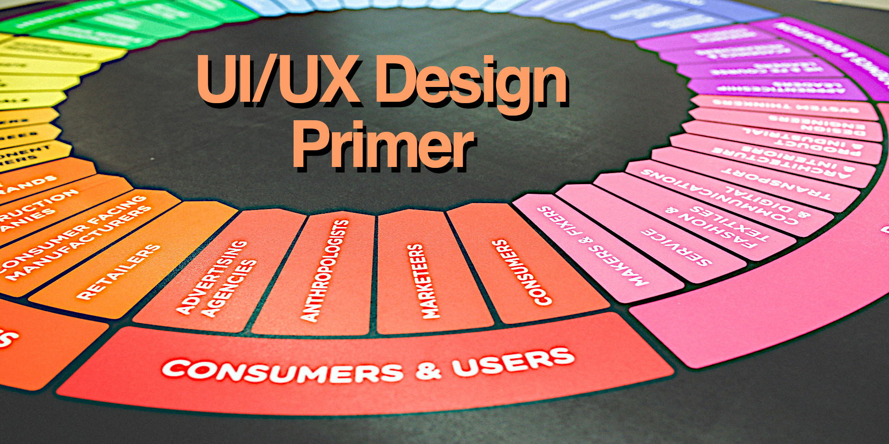

    <b>I'm a software developer specializing in technology consulting.</b>
     
    <a href="mailto:joel@joelparkerhenderson.com">joel@joelparkerhenderson.com</a>
    &bull;
    <a href="tel:1-415-317-2700">1-415-317-2700</a>
    &bull;
    <a href="https://raw.githubusercontent.com/joelparkerhenderson/resume/main/joelparkerhenderson-resume.pdf">résumé</a>

    
    
    
    
    
    
    
    

  
Contact

      <ul>
        <li>LinkedIn: <a href="https://linkedin.com/in/joelparkerhenderson">https://linkedin.com/in/joelparkerhenderson</a></li>
        <li>GitHub: <a href="https://github.com/joelparkerhenderson">https://github.com/joelparkerhenderson</a></li>
        <li>Twitter: <a href="https://twitter.com/joel_henderson">https://twitter.com/joel_henderson</a></li>
        <li>Facebook: <a href="https://facebook.com/joelparkerhenderson">https://facebook.com/joelparkerhenderson</a></li>
        <li>Instagram: <a href="https://instagram.com/joelparkerhenderson">https://instagram.com/joelparkerhenderson</a></li>
        <li>AngelList: <a href="https://angel.co/joelparkerhenderson">https://angel.co/joelparkerhenderson</a></li>
        <li>Crunchbase: <a href="https://www.crunchbase.com/person/joel-parker-henderson">https://www.crunchbase.com/person/joel-parker-henderson</a></li>
        <li>Calendly: <a href="https://calendly.com/joelparkerhenderson">https://calendly.com/joelparkerhenderson</a></li>
        <li>PayPal: <a href="https://paypal.me/joelparkerhenderson">https://paypal.me/joelparkerhenderson</a></li> 
        <li>Venmo: <a href="https://account.venmo.com/u/joelparkerhenderson">https://account.venmo.com/u/joelparkerhenderson</a></li> 
        <li>Soundcloud: <a href="https://soundcloud.com/joelparkerhenderson">https://soundcloud.com/joelparkerhenderson</a>
    </li>

 

    
Leadership consulting repositories

    <ul>
        <li><a href="https://github.com/joelparkerhenderson/adkar-change-management-model">ADKAR change management model</a></li>
        <li><a href="https://github.com/joelparkerhenderson/agile-assessment">Agile assessment</a></li>
        <li><a href="https://github.com/joelparkerhenderson/always-improving">Always improving: book summaries</a></li>
        <li><a href="https://github.com/joelparkerhenderson/architecture-decision-record">Architecture Decision Record (ADR)</a></li>
        <li><a href="https://github.com/joelparkerhenderson/business-model-canvas">Business model canvas (BMC)</a></li>
        <li><a href="https://github.com/joelparkerhenderson/code-of-conduct-guidelines">Code of conduct guidelines</a></li>
        <li><a href="https://github.com/joelparkerhenderson/company-culture">Company culture</a></li>
        <li><a href="https://github.com/joelparkerhenderson/coordinated-disclosure">Coordinated disclosure</a></li>
        <li><a href="https://github.com/joelparkerhenderson/critical-success-factor">Critical success factor (CSF)</a></li>
        <li><a href="https://github.com/joelparkerhenderson/crucial-conversations">Crucial conversations</a></li>
        <li><a href="https://github.com/joelparkerhenderson/decision-record">Decision Record (DR) template</a></li>
        <li><a href="https://github.com/joelparkerhenderson/discovery-assessment">Discovery assessment</a></li>
        <li><a href="https://github.com/joelparkerhenderson/enterprise-architecture-assessment">Enterprise architecture assessment</a></li>
        <li><a href="https://github.com/joelparkerhenderson/feedback-request-template">Feedback request template</a></li>
        <li><a href="https://github.com/joelparkerhenderson/first-aid-kit">First ait kit for teams</a></li>
        <li><a href="https://github.com/joelparkerhenderson/functional-specifications-template">Functional specifications template</a></li>
        <li><a href="https://github.com/joelparkerhenderson/functional-specifications-tutorial">Functional specifications tutorial</a></li>
        <li><a href="https://github.com/joelparkerhenderson/goals-ideas-steps-tasks">Goals Ideas Steps Tasks (GIST)</a></li>
        <li><a href="https://github.com/joelparkerhenderson/icebreaker-questions">Icebreaker questions</a></li>
        <li><a href="https://github.com/joelparkerhenderson/intent-plan">Intent plan</a></li>
        <li><a href="https://github.com/joelparkerhenderson/issues">Issues</a></li>
        <li><a href="https://github.com/joelparkerhenderson/key-performance-indicator">Key Performance Indicator (KPI)</a></li>
        <li><a href="https://github.com/joelparkerhenderson/key-risk-indicator">Key Risk Indicator (KRI)</a></li>
        <li><a href="https://github.com/joelparkerhenderson/leadership">Leadership: selected notes &amp; advice</a></li>
        <li><a href="https://github.com/joelparkerhenderson/lean-business-lists">Lean business lists</a></li>
        <li><a href="https://github.com/joelparkerhenderson/maturity-models">Maturity models (MMs)</a></li>
        <li><a href="https://github.com/joelparkerhenderson/metrics">Metrics: ideas &amp; examples</a></li>
        <li><a href="https://github.com/joelparkerhenderson/milestones">Milestones: ideas &amp; examples</a></li>
        <li><a href="https://github.com/joelparkerhenderson/net-promoter-score">Net promoter score (NPS)</a></li>
        <li><a href="https://github.com/joelparkerhenderson/objectives-and-key-results">Objectives &amp; Key Results (OKR)</a></li>
        <li><a href="https://github.com/joelparkerhenderson/oblique-strategies">Oblique strategies for creative thinking</a></li>
        <li><a href="https://github.com/joelparkerhenderson/ooda-loop">OODA loop: Observe Orient Decide Act</a></li>
        <li><a href="https://github.com/joelparkerhenderson/outputs-vs-outcomes">Outputs vs. outcomes (OVO)</a></li>
        <li><a href="https://github.com/joelparkerhenderson/pitch-deck-quick-start">Pitch deck quick start</a></li>
        <li><a href="https://github.com/joelparkerhenderson/powerful-questions">Powerful questions: insight, innovation, action</a></li>
        <li><a href="https://github.com/joelparkerhenderson/project-management-checklist">Project management checklist</a></li>
        <li><a href="https://github.com/joelparkerhenderson/quad-chart">Quad chart</a></li>
        <li><a href="https://github.com/joelparkerhenderson/queueing-theory">Queueing theory</a></li>
        <li><a href="https://github.com/joelparkerhenderson/responsibility-assignment-matrix">Responsibility assignment matrix (RAM)</a></li>
        <li><a href="https://github.com/joelparkerhenderson/smart-criteria">SMART criteria</a></li>
        <li><a href="https://github.com/joelparkerhenderson/social-value-orientation">Social value orientation (SVO)</a></li>
        <li><a href="https://github.com/joelparkerhenderson/software-development-methodologies">Software development methodologies</a></li>
        <li><a href="https://github.com/joelparkerhenderson/spade-decision-framework">SPADE decision framework</a></li>
        <li><a href="https://github.com/joelparkerhenderson/stakeholder-analysis">Stakeholder analysis</a></li>
        <li><a href="https://github.com/joelparkerhenderson/statement-of-work">Statement Of Work (SOW) template</a></li>
        <li><a href="https://github.com/joelparkerhenderson/strategic-balanced-scorecard">Strategic Balanced Scorecard (SBS)</a></li>
        <li><a href="https://github.com/joelparkerhenderson/system-quality-attributes">System quality attributes (SQAs)</a></li>
        <li><a href="https://github.com/joelparkerhenderson/team-focus">TEAM FOCUS teamwork framework</a></li>
        <li><a href="https://github.com/joelparkerhenderson/thought-leadership-writing">Thought leadership writing</a></li>
        <li><a href="https://github.com/joelparkerhenderson/value-stream-mapping">Value Stream Mapping (VSM)</a></li>
        <li><a href="https://github.com/joelparkerhenderson/vision-statements">Vision statements &amp; mission statements</a></li>
        <li><a href="https://github.com/joelparkerhenderson/ways-of-working">Ways of working for teams</a></li>
        <li><a href="https://github.com/joelparkerhenderson/wordbooks">Wordbooks: glossaries, lexicons, terminology</a></li>
        <li><a href="https://github.com/sixarm/sixarm-company-confidentiality-agreement">Confidentiality agreement</a></li>
        <li><a href="https://github.com/sixarm/sixarm-company-consulting-agreement">Consulting agreement</a></li>
    </ul>

    
Primer guidebook repositories

    <ul>
        <li><a href="https://github.com/sixarm/innovation-partnership-primer">Innovation Partnership Primer</a></li>
        <li><a href="https://github.com/sixarm/startup-business-primer">Startup Business Primer</a></li>
        <li><a href="https://github.com/sixarm/business-lingo-primer">Business Lingo Primer</a></li>
        <li><a href="https://github.com/sixarm/project-management-primer">Project Management Primer</a></li>
        <li><a href="https://github.com/sixarm/ui-ux-design-primer">UI/UX Design Primer</a></li>
    </ul>

    
Git guidance repositories

    <ul>
        <li><a href="https://github.com/joelparkerhenderson/git-commit-message">Git commit message</a></li>
        <li><a href="https://github.com/joelparkerhenderson/git-commit-template">Git commit template</a></li>
        <li><a href="https://github.com/joelparkerhenderson/git-branch-name">Git branch name</a></li>
        <li><a href="https://github.com/joelparkerhenderson/git-hooks">Git hooks</a></li>
        <li><a href="https://github.com/joelparkerhenderson/git-workflow-help">Git workflow help</a></li>
        <li><a href="https://github.com/joelparkerhenderson/github-special-files-and-paths">GitHub special files and paths</a></li>
        <li><a href="https://github.com/joelparkerhenderson/monorepo-vs-polyrepo">Monorepo vs. polyrepo</a></li>
    </ul>

    
Demo technology repositories

    <ul>
        <li><a href="https://github.com/joelparkerhenderson/demo-aws-lambda">AWS Lamba</a></li>
        <li><a href="https://github.com/joelparkerhenderson/demo-consul">Consul</a></li>
        <li><a href="https://github.com/joelparkerhenderson/demo-d3-divs">D3 Divs</a></li>
        <li><a href="https://github.com/joelparkerhenderson/demo-d3-stickies">D3 Stickies</a></li>
        <li><a href="https://github.com/joelparkerhenderson/demo-d3-target">D3 Target</a></li>
        <li><a href="https://github.com/joelparkerhenderson/demo-data-schema-transforms">Schema transforms</a></li>
        <li><a href="https://github.com/joelparkerhenderson/demo-date-time-format">Date-Time Format</a></li>
        <li><a href="https://github.com/joelparkerhenderson/demo-elixir-phoenix">Elixir &amp; Phoenix</a></li>
        <li><a href="https://github.com/joelparkerhenderson/demo-java-spring-boot-rest">Java Spring Boot Rest</a></li>
        <li><a href="https://github.com/joelparkerhenderson/demo-job-title-descriptions">Job title descriptions</a></li>
        <li><a href="https://github.com/joelparkerhenderson/demo-json-api-beginner">JSON API beginner</a></li>
        <li><a href="https://github.com/joelparkerhenderson/demo-json-api-hello-world">JSON API hello world</a></li>
        <li><a href="https://github.com/joelparkerhenderson/demo-json-api-specification">JSON API specifications</a></li>
        <li><a href="https://github.com/joelparkerhenderson/demo-liquibase-hello-world">Liquibase hello world</a></li>
        <li><a href="https://github.com/joelparkerhenderson/demo-liquibase-yaml">Liquibase YAML</a></li>
        <li><a href="https://github.com/joelparkerhenderson/demo-optaplanner">OptaPlanner onstraint satisfaction solver</a></li>
        <li><a href="https://github.com/joelparkerhenderson/demo-oracle-sql-todo">Oracle SQL todo</a></li>
        <li><a href="https://github.com/joelparkerhenderson/demo-python-flask-hello-world">Python Flask hello world</a></li>
        <li><a href="https://github.com/joelparkerhenderson/demo-ruby-sinatra-hello-world">Ruby Sinatra hello world</a></li>
        <li><a href="https://github.com/joelparkerhenderson/demo-selenium-javascript">Selenium JavaScript</a></li>
        <li><a href="https://github.com/joelparkerhenderson/demo-selenium-javascript-e2e-tests">Selenium JavaScript E2E tests</a></li>
        <li><a href="https://github.com/joelparkerhenderson/demo-shopping-cart-exercise-with-ruby">Shopping cart exercise with Ruby</a></li>
        <li><a href="https://github.com/joelparkerhenderson/demo-swagger">Swagger a.k.a. OpenAPI</a></li>
        <li><a href="https://github.com/joelparkerhenderson/demo-swift-alamofire">Swift Alamofire for networking</a></li>
        <li><a href="https://github.com/joelparkerhenderson/demo-swift-carthage">Swift Carthage for packagem management</a></li>
        <li><a href="https://github.com/joelparkerhenderson/demo-swift-charts">Swift Charts</a></li>
        <li><a href="https://github.com/joelparkerhenderson/demo-swift-excel-xlsx-reader-writer">Swift Excel XLSX reader/writer</a></li>
        <li><a href="https://github.com/joelparkerhenderson/demo-swift-hello-world">Swift Hello World</a></li>
        <li><a href="https://github.com/joelparkerhenderson/demo-swift-items">Swift items</a></li>
        <li><a href="https://github.com/joelparkerhenderson/demo-swift-master-detail">Swift master/detail</a></li>
        <li><a href="https://github.com/joelparkerhenderson/demo-swift-news">Swift news</a></li>
        <li><a href="https://github.com/joelparkerhenderson/demo-swift-objectmapper">Swift ObjectMapper for JSON models</a></li>
        <li><a href="https://github.com/joelparkerhenderson/demo-swift-quick-nimble">Swift Quick Nimble for TDD BDD testing</a></li>
        <li><a href="https://github.com/joelparkerhenderson/demo-swift-realm">Swift Realm mobile database</a></li>
        <li><a href="https://github.com/joelparkerhenderson/demo-swift-rest">Swift REST</a></li>
        <li><a href="https://github.com/joelparkerhenderson/demo-swift-rest-master-detail-page">Swift REST master/detail page</a></li>
        <li><a href="https://github.com/joelparkerhenderson/demo-swift-sqlite">Swift SQLite</a></li>
        <li><a href="https://github.com/joelparkerhenderson/demo-swift-taylor">Swift Taylor</a></li>
        <li><a href="https://github.com/joelparkerhenderson/demo-swift-text-view">Swift text view</a></li>
        <li><a href="https://github.com/joelparkerhenderson/demo-tailwind-css">Tailwind CSS</a></li>
        <li><a href="https://github.com/joelparkerhenderson/demo-terraform">Terraform</a></li>
        <li><a href="https://github.com/joelparkerhenderson/demo-terraform-2">Terraform 2</a></li>
        <li><a href="https://github.com/joelparkerhenderson/demo-trello-api">Trello API for boards and cards</a></li>
        <li><a href="https://github.com/joelparkerhenderson/demo-vagrant-virtualbox-aws">Vagrant VirtualBox AWS</a></li>
        <li><a href="https://github.com/joelparkerhenderson/demo-yaml-files-to-swift-classes">YAML files to Swift classes</a></li>
    </ul>

    

    

    

    

    

</body>